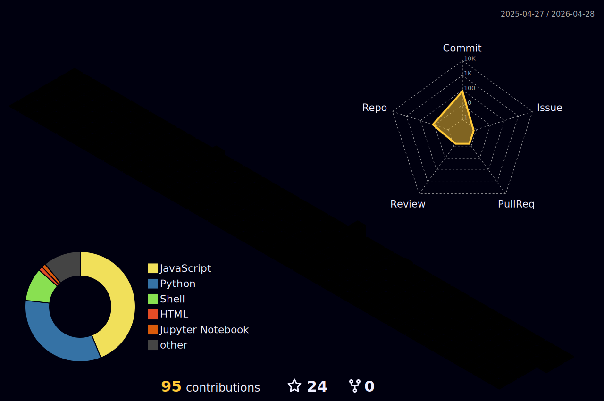

  
    
  
  
    
  
  
    
  

 
 

# Hi 👋 I'm Mahdi Ghofran

A passionate DevOps Engineer and Full-Stack Developer specializing in intelligent automation, MLOps, and scalable system architectures.

Welcome to my GitHub! Here you'll find repositories showcasing my work in DevOps, CI/CD automation, cloud infrastructure, robotics software, and AI-powered systems.

👨‍💻 I'm currently working on building scalable MLOps pipelines and developing full-stack AI-based video analysis platforms.

🌱 My skills span DevOps & MLOps, CI/CD Automation, Container Orchestration, Cloud Infrastructure, Backend Development, Robotics Software Engineering, AI/ML Systems, Embedded Systems, and Industrial Automation.
 
💬 I'm happy to answer any questions about DevOps best practices, automation workflows, robotics software, or AI system deployment.
 
📫 How to reach me: mahdi.ghofran.dev@gmail.com

⚡ Fun Fact: I love building end-to-end automated systems from bare metal to cloud!
  
---
 
## Connect with Me

---

# 💻 Tech Stack & Expertise:

<!-- my-skills -->
| Property                                        | Data                                                                                                                                                                                                                                                                                                                                                                                                                                                                                                                                                                                                                                                                                                                                                                                                                                                                                                                                                                                                                                                                                                                                                                                                                                                                                                                                                                                                                                                                                                                                                                                                                                                                                                                                                                                                            |
|-------------------------------------------------|-------------------------------------------------------------------------------------------------------------------------------------------------------------------------------------------------------------------------------------------------------------------------------------------------------------------------------------------------------------------------------------------------------------------------------------------------------------------------------------------------------------------------------------------------------------------------------------------------------------------------------------------------------------------------------------------------------------------------------------------------------------------------------------------------------------------------------------------------------------------------------------------------------------------------------------------------------------------------------------------------------------------------------------------------------------------------------------------------------------------------------------------------------------------------------------------------------------------------------------------------------------------------------------------------------------------------------------------------------------------------------------------------------------------------------------------------------------------------------------------------------------------------------------------------------------------------------------------------------------------------------------------------------------------------------------------------------------------------------------------------|
| **DevOps & CI/CD**                              |          |
| **Programming Languages**                       |          |
| **Backend & API Development**                   |        |
| **Databases**                                   |         |
| **Cloud & Infrastructure**                      |           |
| **AI & Machine Learning**                       |         |
| **Robotics & Embedded Systems**                 |            |
| **Frontend & UI Development**                   |         |
| **Version Control & Collaboration**             |      |
| **Industrial Automation**                       |        |
| **Tools & Platforms**                           |        |
| **Design & Hardware**                           |     |
                                                                                                                                                                                                                

---

## 🚀 Areas of Expertise & Interest:

### DevOps & CI/CD Engineering
- **CI/CD Pipeline Development:** Designing and implementing automated CI/CD pipelines using Jenkins, GitHub Actions, and GitLab CI for rapid, reliable software delivery
- **Container Orchestration:** Managing containerized applications with Docker and Kubernetes, implementing microservices architectures
- **Monitoring & Observability:** Setting up comprehensive monitoring solutions with Prometheus, Grafana, and ELK stack
- **Cloud Infrastructure:** Deploying and managing scalable applications on AWS, Azure, and Google Cloud platforms
- **Build Automation:** Creating automated build and deployment workflows for continuous integration and delivery

### Full-Stack Development
- **Backend Systems:** Building robust, scalable backend systems with Django, FastAPI, and Node.js
- **Real-Time Communication:** Developing low-latency WebSocket servers and real-time data streaming applications
- **API Design:** Creating RESTful APIs with comprehensive documentation and testing
- **Database Management:** Designing efficient database schemas and optimizing queries for PostgreSQL, MongoDB, and Redis
- **Frontend Development:** Creating responsive, modern web interfaces with React.js, Flutter, and Qt/QML

### Robotics Software Engineering
- **ROS Development:** Extensive experience with ROS 1 and ROS 2 for developing autonomous robotics systems
- **6-DoF Robot Systems:** Developing control systems and navigation algorithms for autonomous 6-DoF robots
- **Simulation & Testing:** Creating high-fidelity simulations in Gazebo for validation of control algorithms and perception systems
- **Control Systems:** Implementing advanced control algorithms including PID, LQR, MPC, and trajectory planning
- **Robot Kinematics & Dynamics:** Working with forward/inverse kinematics, dynamics modeling, and motion planning

### AI & Machine Learning
- **Deep Learning Models:** Developing and deploying neural networks using PyTorch and TensorFlow
- **Video Analysis:** Building AI-powered video analysis platforms for medical and industrial applications
- **Edge AI:** Deploying ML models on embedded platforms like NVIDIA Jetson and Raspberry Pi
- **Model Optimization:** Optimizing models for inference speed and memory efficiency on edge devices
- **Data Processing:** Working with NumPy, pandas, and scikit-learn for data analysis and machine learning workflows

### Embedded Systems & IoT
- **Microcontroller Programming:** Firmware development for STM32, ESP32, and Raspberry Pi
- **Real-Time Systems:** Designing real-time embedded systems with RTOS
- **Sensor Fusion:** Integrating multiple sensors (IMU, LiDAR, cameras) for autonomous systems
- **IoT Platforms:** Building smart home and industrial IoT solutions with MQTT and WebSocket protocols

### Industrial Automation
- **PLC Programming:** Developing automation solutions using Siemens TIA Portal and Delta PLCs
- **HMI/SCADA Design:** Creating intuitive human-machine interfaces for industrial control systems
- **Industrial Networks:** Working with Modbus, Profinet, and other industrial communication protocols
- **Process Automation:** Implementing automated manufacturing and quality control systems

---

# GitHub Stats

<table align="center">
  <tr>
    <td colspan="2" align="center"></td>
  </tr>
  <tr>
    <td align="center"></td>
    <td align="center"></td>
  </tr>
  <tr>
    <td align="center"></td>
    <td align="center"></td>
  </tr>
  <tr>
    <td colspan="2" align="center">
       
    </td>
  </tr>
</table>

## 🔥 My lovely snake!

##   GitHub Activity Graph 

  

---

## GitHub Trophies 🏆

---

---

Feel free to reach out about DevOps, automation, robotics, or AI systems – I'm always happy to collaborate and share knowledge!

